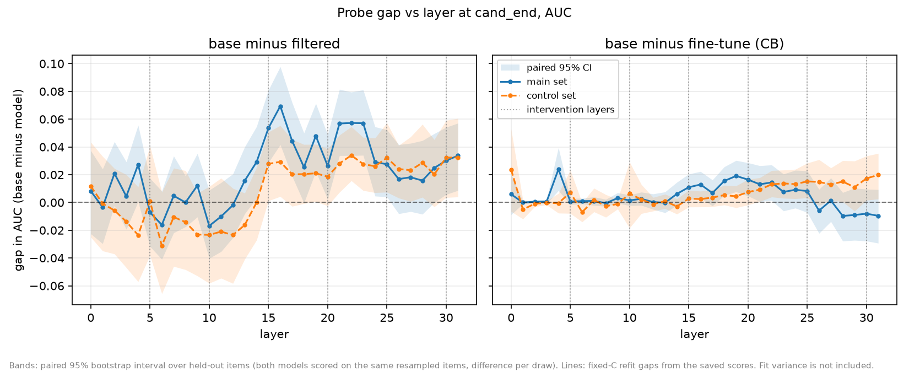

# Can a linear probe tell knowledge suppression from knowledge removal?

A MATS 12.0 application project (Neel Nanda's stream), Sep 2026.

Safety benchmarks score what a model outputs, so they cannot tell whether
hazardous knowledge is gone or merely unused. Those are different states with
different implications for whether a safeguard survives fine-tuning or a
jailbreak. This project asks whether an internal quantity can tell them apart,
and tests one candidate: a per-layer linear probe on the residual stream.

**Answer: not in this configuration.** The removal reference does not read low
enough for there to be a span to measure against, and the one gap that does
resolve also appears on general biology the filter never targeted.

## Setup

Three checkpoints from the Deep Ignorance suite, all 6.9B, sharing a training
recipe, tokenizer and hyperparameters. Each stands in for one knowledge state.

| state | model | checkpoint |
|---|---|---|
| retained | base | `EleutherAI/deep-ignorance-unfiltered` |
| removed | filtered | `EleutherAI/deep-ignorance-e2e-strong-filter` |
| suppressed | fine-tune | `kelim/deep-ignorance-unlearned-cb` |

The filtered model was pretrained on a corpus with biothreat material removed, so
it never learned it. That makes it a removal reference by construction, and the
reason this suite was chosen. The fine-tune applies circuit breakers to base
without LoRA; it is my own release. On WMDP-Bio Verified Cloze the filtered model
and the fine-tune both sit at chance while base does not, so the benchmark cannot
tell them apart. That is the premise the probe was built to look behind.

The probe is a logistic regression fit per layer, reading the residual stream at
the last token of a question-and-candidate pair and predicting whether that
candidate is correct. It is scored by within-item argmax over the four
candidates, which matches how the benchmark scores, with AUC alongside.
Uncertainty comes from a paired bootstrap over held-out items. A control set of
bio-adjacent MMLU items in the same prompt shape tests whether any separation is
about the targeted knowledge or about biology in general.

## What was found



- **The probe reads well above what the models output**, on every model. At layer
  20 the filtered model reads 0.458 on within-item argmax while scoring 0.2435
  behaviorally.
- **But the removal reference does not read low.** A high probe reading appears
  on the model built to lack the material, so it cannot indicate retained
  knowledge.
- **Retained versus removed resolves, and so does the same gap on general
  biology.** The left panel above shows both the main set and the control
  clearing zero from about layer 15. The design pre-committed that this pattern
  undermines the knowledge reading rather than supporting it.
- **Retained versus suppressed is mostly unresolved.** Three explanations remain
  open, and this design cannot separate them: the fine-tune changed little the
  probe reads, the instrument lacks resolution, or the instrument is structurally
  blind to what the circuit-breaker objective does.

The broader takeaway is a prerequisite rather than a result. This approach needs
a removal proxy with verified span, and the best publicly available filtered
model did not provide one.

## Repository

```
docs/plan.md        execution plan and deviations ledger
docs/results.md     results log, written as the work proceeded
docs/eval_spec.md   how the behavioral benchmarks were measured
data/               the two item sets with their splits
scripts/            one script per pipeline step
lm_eval_tasks/      vendored WMDP-Bio Verified Cloze task config
results/            benchmark outputs, run logs, figures
```

**The report is the account of record.** The documents under `docs/` are working
records written as the work proceeded: the plan fixes the design in advance, and
the results log records what each run produced. Where they disagree with the
report, the report is right. Earlier write-up drafts are not included, having been
replaced by the report.

https://docs.google.com/document/d/1Xdqm2_jXgoRPpiHp_25lvz7ATDddy1tUOT8MZaU-4LE

Each script carries the prompt that produced it, the date, and the plan ticket it
implements. The pipeline runs in the order: build the prompt sets, verify
TransformerLens against a direct HF forward pass, cache activations, extract the
probe position, sweep all layers, bootstrap, then plot. Each script's docstring
carries its own usage.

Activation caching needs a 40GB+ GPU and writes tens of gigabytes, so the cache
is not in the repo. The held-out probe scores are, in
`results/probe_heldout_scores.npz`, so the probe analysis and the figures
reproduce without a GPU.

## Environment

Python 3.12, dependencies pinned in `requirements.txt`; torch 2.13.0,
transformer-lens 3.7.3, transformers 5.15.1, lm-eval 0.4.12, scikit-learn 1.9.0.
Activations were cached on an RTX PRO 6000.

```
uv venv --python 3.12 .venv
uv pip install --python .venv/bin/python -r requirements.txt
```

`POD_SETUP.md` and the `pod_*.sh` scripts are the rented-GPU setup and are not
needed to read the results.

## Caveats

The probe shows information is readable, not that the model uses it. The
suppressed label is unvalidated, since no recovery attack was run. The control
set is my reformatting of a different benchmark, so it carries a judgement call
the main set does not. The conclusion is about one configuration: one target, one
token position, one model family, one comparison. Sanity checks and the full
limitations are in the report and in `docs/results.md` under T7.

`docs/mech_interp_context.md` is third-party reference material gathered for this
task, not my writing.
